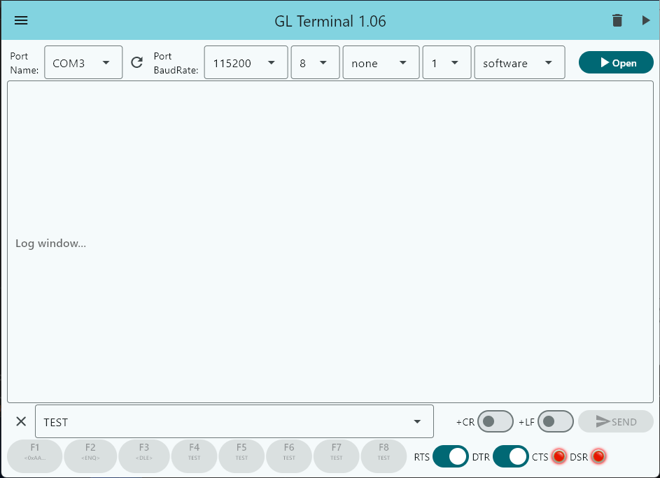

# GLTerminal

#### GL Terminal is a advanced RS232 terminal application running directly from the web. Features:
* using **Web Assembly** and *Web Serial* to communicate with *Serial Port*,
* using symbols and hex codes for sending binnary data from text field (eg. <STX>, <0xFE>),
* remember settings,
* 8 memory fields witch can be used with keys F1..F8,
* fast and quick,
* no installation needed,
* multiplatform.
  
## Use standalone application.
* Standalone application may be downloaded from release section.

## Screens

## License

MIT
